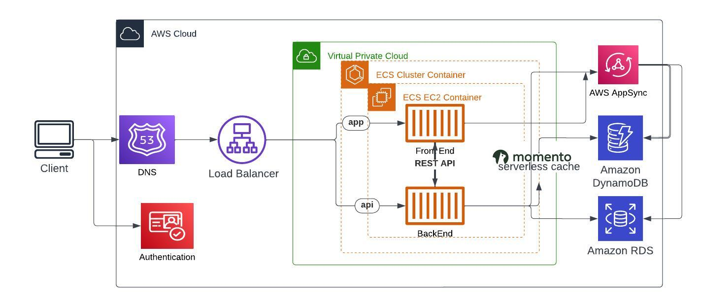

# Week 0 — Billing and Architecture

# Conceptual Design 

# Logical Design Diagram
I think authentication service dont need to communicate with backend. It could either use internal users or external auth providers. In this case i did not inlcude external auth provider, but i can change this diagram later to include that

